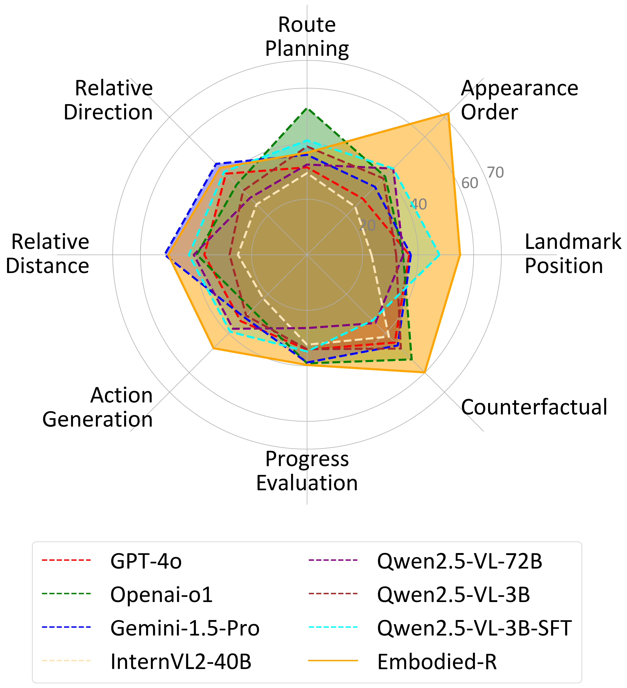

# Embodied-R: Collaborative Framework for Activating Embodied Spatial Reasoning in Foundation Models via Reinforcement Learning

`<a href='https://arxiv.org/pdf/2504.12680'>``</a>` &nbsp;
`<a href='https://embodiedcity.github.io/Embodied-R/'>``</a>`

This project provides the official code for Embodied-R, a collaborative framework designed to enhance embodied spatial reasoning tasks. Embodied-R leverages the perceptual capabilities of large-scale Vision-Language Models (VLMs) and achieves significant performance improvements by training only a small-scale Language Model (LM). By combining the strengths of these models, Embodied-R offers an efficient yet powerful solution for complex spatial reasoning tasks in embodied AI.

<p align="center">
  
  
</p>

## News

[2025/04/19] We release the basic training and inference code of Embodied-R.

## Installation

The Embodied-R project is built on the ModelScope ms-swift open-source framework. Please follow these steps to install:

1. Ensure your environment meets the following requirements:

   - Python = 3.10
   - Transformers = 4.51
   - DeepSpeed = 0.14.5
   - VLLM = 0.7.3
2. Install the ms-swift framework:

   ```bash
   pip install ms-swift -U
   ```
3. Clone this repository:

   ```bash
   git clone https://github.com/your-username/Embodied-R.git
   cd Embodied-R
   ```

## Setup

### Data Preparation

First, download the [UrbanVideo-Bench](https://huggingface.co/datasets/EmbodiedCity/UrbanVideo-Bench) and [VSI-Bench](https://huggingface.co/datasets/nyu-visionx/VSI-Bench) datasets.

After downloading, organize the directories as shown below (some parts are omitted with "..."):

```
Embodied-R.code/
├── assets/
├── dataset/
│   ├── UrbanVideo-Bench/
│   │   ├── videos/
│   │   ├── MCQ.parquet
│   │   └── ...
│   ├── VSI-Bench/
│   │   ├── arkitscenes.zip
│   │   ├── scannet.zip
│   │   ├── scannetpp.zip
│   │   ├── test-00000-of-00001.parquet
│   │   └── ...
└── ...
```

### Model Weight Download

Embodied-R uses two main models: a vision module and a reasoning module.

1. **Vision Module Model**:

   - Download [Qwen/Qwen2.5-VL-72B-Instruct](https://huggingface.co/Qwen/Qwen2.5-VL-72B-Instruct)
   - This large vision-language model is responsible for processing video frames and extracting key semantic information
2. **Reasoning Module Model**:

   - Download [Qwen/Qwen2.5-3B-Instruct](https://huggingface.co/Qwen/Qwen2.5-3B-Instruct)
   - This small language model is trained with reinforcement learning, specifically for spatial reasoning tasks

After downloading, place the model weights in an appropriate directory, or specify the model path when running scripts.

## Inference Examples

Embodied-R provides two inference methods: batch inference and interactive inference.

### Batch Inference

**Important: Complete Video Processing Pipeline**

Before running batch inference, you need to first process videos using `train/VLM_perception.py` to generate text descriptions of the videos. This step converts video content into text representations for the reasoning model to use. The complete pipeline is as follows:

1. Generate video descriptions using the vision model:

   ```bash
   python train/VLM_perception.py
   ```
2. Run batch inference using the generated text descriptions:

   ```bash
   cd infer
   bash run_batch_inference.sh \
     --model "path/to/reasoning/model" \
     --input_file "path/to/video_descriptions.json" \
     --output_file "path/to/output.json" \
     --batch_size 1 \
     --max_tokens 3096
   ```

Input JSON file format example:

```json
[
  {
    "Question_id": "video_infer",
    "video_id": "example.mp4",
    "question_category": "object_rel_direction",
    "question": "<video>Please assume the role of an agent...",
    "answer": "A",
    "videos": "path/to/video.mp4"
  },
  {
    "Question_id": "text_infer",
    "question": "Please assume the role of an agent...",
    "answer": "B"
  }
]
```

**Important Notes**:

- **Video Inference**: You must add the `<video>` prefix to the `question` field and include both `videos` and `question` fields. Other fields (such as `Question_id`, `video_id`, etc.) are optional.
- **Text Inference**: Only the `question` field is required.
- The inference results will preserve all input fields (pass-through) and add a `content` field containing the model's response.

### Interactive Inference

Interactive inference provides a command-line interface that allows users to upload videos and ask questions. Start interactive inference using the following command:

```bash
cd infer
bash run_video_chat.sh
```

You can customize the vision model and reasoning model by modifying the `run_video_chat.sh` script:

```bash
# Set model paths
VISION_MODEL="Qwen/Qwen2.5-Vl-72B-Instruct"  # Vision model path
REASONING_MODEL="Qwen/Qwen2.5-3B-Instruct"   # Reasoning model path

# Set parameters
MAX_TOKENS=4096                # Max output tokens for reasoning module
TEMPERATURE=0.7                # Temperature for reasoning module
VISION_MAX_TOKENS=6144         # Max output tokens for vision module
VISION_TEMPERATURE=0.1         # Temperature for vision module
```

## RL Training

Embodied-R uses Reinforcement Learning (RL) to train the reasoning module for high-quality spatial reasoning. The training code is located in the `train` folder.

### Training Environment Requirements

Recommended configuration: 8x NVIDIA A800 GPUs with 40GB memory each

### Training Pipeline

**Important: Complete Training Data Preparation Process**

Before training the model, you need to complete the following data preparation steps:

1. Generate video descriptions using the vision model:

   ```bash
   python train/VLM_perception.py
   ```
2. Convert the generated text descriptions to GRPO training format:

   ```bash
   python train/conver_GrpoFormat.py
   ```
3. Start training:

   ```bash
   bash train/train.sh
   ```

The training script uses the GRPO (Group Relative Policy Optimization) algorithm, a PPO variant designed specifically for large language models. You can customize the training process by modifying parameters in `train.sh`:

```bash
# Key parameters
--model "Qwen/Qwen2.5-3B-Instruct"  # Base model
--reward_weights 0.7 0.1 0.2         # Reward weights (accuracy, format, consistency)
--reward_funcs choice_accuracy format consistency  # Reward functions
--learning_rate 5e-7                 # Learning rate
--num_train_epochs 2                 # Number of training epochs
```

### Reward Modeling

Embodied-R uses two main rewards to guide model learning:

1. **Choice Accuracy Reward**:

   - Evaluates whether the model's answer matches the correct answer
   - Implemented in `train/choice_accuracy_reward.py`
2. **Consistency Reward**:

   - Evaluates whether the model's reasoning process is logically consistent with its final answer
   - Works by inputting the reasoning process into a reference model to check if it produces the same answer
   - Implemented in `train/consistency_reward.py`
   - **Important**: Before using, you need to fill in API keys from the Bailian platform in the `train/consistency_reward.py` file:

     ```python
     # Enter your API keys here
     default_api_keys = [
         # API keys obtained from the Bailian platform
     ]
     ```

     Please visit the [Bailian platform](https://www.aliyun.com/product/bailian) to apply for API keys

Additionally, there is a format reward that ensures the model output follows the format `<think>reasoning process</think><answer>answer</answer>`.

Training adopts a three-stage strategy with gradually adjusted reward weights:

1. Stage 1 (first 2 epochs): Focus on format reward, weight ratio 7:3:0
2. Stage 2 (epochs 3-4): Focus on accuracy reward, weight ratio 3:7:0
3. Stage 3 (epochs 5-12): Focus on both accuracy and consistency, weight ratio 1:7:2

## Citation

```
@misc{zhao2025embodiedr,
      title={Embodied-R: Collaborative Framework for Activating Embodied Spatial Reasoning in Foundation Models via Reinforcement Learning},
      author={Baining Zhao and Ziyou Wang and Jianjie Fang and Chen Gao and Fanhang Man and Jinqiang Cui and Xin Wang and Xinlei Chen and Yong Li and Wenwu Zhu},
      year={2025},
      eprint={2504.12680},
      archivePrefix={arXiv},
      primaryClass={cs.AI},
      url={https://arxiv.org/abs/2504.12680},
}
```
